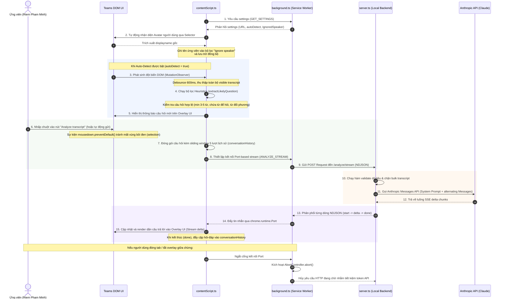

# Teams Interview Copilot - Agent Handoff Knowledge Base

Tài liệu này chứa thông tin toàn diện về kiến trúc hệ thống, cấu trúc thư mục, luồng dữ liệu, chi tiết triển khai kỹ thuật, các ràng buộc bảo mật và hướng dẫn vận hành của dự án **Teams Interview Copilot**.

---

## 1. Mục tiêu & Các Giới hạn của Sản phẩm

**Teams Interview Copilot** là một Chrome Extension chạy trên nền tảng Microsoft Teams Web (phiên bản Chrome). Nó hỗ trợ ứng viên trong quá trình phỏng vấn trực tuyến bằng cách phát hiện các câu hỏi từ interviewer trong DOM hiển thị, gửi về một local backend bảo mật, xử lý qua mô hình Claude (Anthropic SDK) và hiển thị các gợi ý trả lời trực quan trên một giao diện đè (Overlay UI) nổi trên màn hình Teams.

### Các giới hạn/nguyên tắc cốt lõi:
1. **Không Capture Audio/Video**: Hoàn toàn không ghi âm hay quay màn hình để tránh các cảnh báo quyền riêng tư nghiêm trọng từ trình duyệt và Microsoft Teams.
2. **Không Speech-to-Text**: Thay vào đó, nó tận dụng tính năng RTT (Real-time Transcript / Captions) gốc của Teams hiển thị trên giao diện DOM.
3. **Không Sử dụng Microsoft Graph API / Bot API**: Không cần kết nối hoặc tích hợp chính thức với hệ thống admin của Teams, giúp extension hoạt động độc lập và không bị phát hiện bởi quản trị viên.
4. **Bảo mật API Key**: Anthropic API Key được lưu trữ hoàn toàn tại local backend `.env`, tuyệt đối không bao giờ gửi hoặc nhúng vào mã nguồn của Chrome Extension.
5. **Kiểm soát nội dung gửi đi**: Không gửi toàn bộ transcript liên tục lên LLM để tránh làm loãng ngữ cảnh và vượt quá giới hạn token. Hệ thống chỉ gửi câu hỏi được lọc tự động bởi bộ lọc heuristics hoặc nội dung do người dùng chọn/nhập thủ công.

---

## 2. Cấu trúc Thư mục Dự án

```text
teams-interview-copilot/
├── AGENT_HANDOFF.md          # Tài liệu bàn giao (File này)
├── README.md                 # Hướng dẫn cài đặt nhanh dự án
├── extension/                # CHROME EXTENSION (Mã nguồn & Cấu hình)
│   ├── manifest.json         # Khai báo quyền, background worker và nội dung inject
│   ├── package.json          # Quản lý dependency & script đóng gói (Sử dụng Vite)
│   ├── tsconfig.json         # Cấu hình TypeScript biên dịch
│   ├── vite.config.ts        # Script bundler gom tệp nguồn vào thư mục 'dist/'
│   └── src/
│       ├── background.ts     # Service Worker quản lý cổng stream NDJSON và settings
│       ├── contentScript.ts  # Logic DOM Scraping, Heuristics lọc câu hỏi và giao thức Port
│       ├── overlay.ts        # Điều khiển UI Overlay (kéo thả, hiển thị kết quả, cài đặt)
│       ├── overlay.css       # CSS thiết kế hệ thống giao diện nổi cao cấp
│       └── types.ts          # Định nghĩa kiểu dữ liệu thống nhất cho giao tiếp Port
│
└── backend/                  # LOCAL BACKEND EXPRESS (Node.js Service)
    ├── .env                  # Tệp lưu trữ biến môi trường (API Key, Port, v.v.)
    ├── .env.example          # Tệp cấu hình mẫu
    ├── package.json          # Script vận hành và các thư viện hỗ trợ (Express, Anthropic SDK)
    ├── tsconfig.json         # Cấu hình TypeScript cho Node.js (ES Module)
    └── src/
        ├── server.ts         # Khởi chạy Express HTTP server, CORS, validation dữ liệu
        ├── prompts/
        │   └── interviewPrompt.ts # Cấu hình System Prompt (Nhập vai "Riem Pham Minh") và User Prompt
        └── providers/
            ├── LLMProvider.ts     # Interface trừu tượng cho nhà cung cấp LLM
            └── AnthropicProvider.ts # Tích hợp Anthropic Messages API với chế độ Stream & Static
```

---

## 3. Luồng Dữ liệu & Chuỗi Sự kiện (Sequence of Events)

Dưới đây là sơ đồ luồng dữ liệu tuần tự khi hệ thống hoạt động:



---

## 4. Chi tiết Kỹ thuật & Logic Cốt lõi của các Thành phần

### A. Phía Chrome Extension (`extension/`)

#### 1. Bộ lọc Heuristics nhận diện câu hỏi (`contentScript.ts`)
*   **Danh sách từ khoá kích hoạt (`questionLeadIns`)**: Hệ thống sử dụng Regex để phát hiện các câu hỏi tự nhiên như `can`, `could`, `would`, `will`, `do`, `does`, `did`, `are`, `is`, `have`, `has`, `how`, `what`, `when`, `where`, `why`, `who`, `which` hoặc các câu lệnh đề nghị `tell me`, `walk me through`, `describe`, `explain`.
*   **Điều kiện chiều dài từ**:
    *   Nếu kết thúc bằng ký tự `?`: Yêu cầu chiều dài câu tối thiểu phải từ **3 từ** trở lên.
    *   Nếu không kết thúc bằng `?` (câu đề nghị): Phải đạt độ dài tối thiểu từ **5 từ** trở lên.
*   **Mẫu từ chối (`rejectedPatterns`)**: Loại bỏ các câu thoại tự vấn bản thân như `"am i"`, `"was i"`, hoặc các từ đệm cảm thán ngắn như `"ok"`, `"yeah"`, `"wait"`, `"hello"`.
*   **Deduplication (Tránh trùng lặp)**: Duy trì một bản đồ bộ nhớ `recentlySeen` với cơ chế **TTL 90 giây** để đảm bảo cùng một câu thoại sẽ không hiển thị thông báo liên tục.

#### 2. DOM Scraper & Cơ chế Gom cụm thoại (Fuzzy Speaker Grouping)
*   **Chiến lược cào 2 tầng**:
    1.  *Tầng 1 (Ưu tiên)*: Quét các selector chuyên dụng của MS Teams như `[data-tid='closed-caption-text']` nằm bên trong container Chat/Caption để thu thập chính xác tên người nói (`[data-tid='author']`) đi kèm nội dung.
    2.  *Tầng 2 (Dự phòng)*: Tìm kiếm theo các selector chung hơn trong `transcriptSelectors` (như `[role='log']`, `[aria-label*='caption']`).
*   **Gom cụm thoại liên tục**: Khi người dùng quét lấy N dòng qua tính năng `getLatestNOpposingEntries(N)`:
    *   Nếu người nói $A$ nói liên tục 2-3 câu thoại liền kề nhau mà không có ai ngắt lời, thuật toán sẽ tự động gộp nội dung của họ lại thành một khối tin nhắn duy nhất: `"Speaker A: Câu 1 Câu 2 Câu 3"` thay vì tách ra thành các dòng rời rạc.

#### 3. Giao diện đè nổi (`overlay.ts` & `overlay.css`)
*   **Cơ chế Kéo thả (Drag & Drop)**: Sử dụng API `PointerEvents` (`pointerdown`, `pointermove`, `pointerup`) đính kèm trên phần Header. Cấp tọa độ tuyệt đối `left` / `top` và lưu đồng bộ vào storage để khi load lại trang overlay vẫn giữ nguyên vị trí cũ.
*   **Reset Vị trí**: Nhấp đúp (Double-Click) vào vùng Header sẽ xóa tọa độ tùy chỉnh, đưa overlay về vị trí mặc định ở giữa màn hình.
*   **Tránh làm mất Selection trên trang Teams**: Trên toàn bộ nút chức năng hành động của Overlay (như nút quét vùng chọn, gửi phân tích, xóa lịch sử), hệ thống lắng nghe sự kiện `mousedown` và lập tức gọi `event.preventDefault()`. Điều này ngăn không cho tiêu điểm trình duyệt (Focus) chuyển sang nút bấm làm biến mất vùng văn bản mà người dùng đang bôi đen trên Teams.
*   **Kiểm soát số dòng quét**: Nút **Use selection** đi kèm ô nhập số `linesToGrab` để quy định số dòng chat/transcript đối phương cần lấy từ DOM khi người dùng không bôi đen thủ công.

#### 4. Quản lý Lịch sử đa lượt (Sliding Window Memory)
*   Duy trì mảng `conversationHistory` chứa các đối tượng có cấu trúc `{ role: "user" | "assistant", content: string }`.
*   Giới hạn **5 lượt phỏng vấn gần nhất** (tối đa 10 tin nhắn) bằng thuật toán cắt mảng `slice(-10)`. Các lượt nói chuyện cũ hơn sẽ tự động bị giải phóng để bảo vệ Claude khỏi tràn ngữ cảnh và tiết kiệm token đầu vào.
*   Nút bấm **Clear History** cho phép người dùng chủ động làm trống lịch sử hội thoại khi chuyển đổi chủ đề phỏng vấn.

#### 5. Background Service Worker (`background.ts`)
*   **Hỗ trợ Cổng kết nối Phân luồng**: Lắng nghe `chrome.runtime.onConnect` với tên kênh `"ANALYZE_STREAM"`.
*   **Quản lý Vòng đời & Tiết kiệm Token (Abort Signal)**: Lưu giữ thực thể `AbortController` riêng biệt cho mỗi phiên kết nối. Nếu người dùng tắt overlay, tải lại tab hoặc chuyển hướng trang, cổng Port sẽ bị ngắt kết nối (`onDisconnect`), Service Worker lập tức kích hoạt `controller.abort()`, truyền tín hiệu hủy yêu cầu `fetch` đang gọi tới Backend. Điều này bảo vệ tài khoản tránh lãng phí token vô ích khi Claude đang sinh câu trả lời dở dang.

---

### B. Phía Local Backend Express (`backend/`)

#### 1. Express Server & Bảo mật CORS (`server.ts`)
*   Cấu hình chính sách CORS nghiêm ngặt: Chỉ chấp nhận các kết nối xuất phát từ localhost (`127.0.0.1`, `localhost`) hoặc các Chrome Extension có schema `chrome-extension://`.
*   **Bộ lọc chặnBulk Transcript (`looksLikeBulkTranscript`)**: Chặn đứng các hành vi gửi lạm dụng toàn bộ transcript dài lên hệ thống. Bộ lọc kiểm tra nếu chuỗi đầu vào chứa từ 3 nhãn người nói trở lên (dạng `Speaker Name: `) HOẶC có chứa từ 8 dấu ngắt câu trở lên, backend sẽ từ chối xử lý và phản hồi lỗi HTTP 400.

#### 2. Tích hợp Mô hình & SDK (`providers/AnthropicProvider.ts`)
*   Hỗ trợ 2 phương thức: Gửi nhận tĩnh (`generateInterviewAnswer`) và stream dữ liệu trực tiếp (`streamInterviewAnswer`).
*   **Sắp xếp mảng tin nhắn hợp quy**: Tự động chuyển đổi lịch sử từ Client thành cấu trúc chuẩn của Anthropic. Vì mảng lịch sử luôn được lưu theo cặp chẵn bắt đầu từ `user` và kết thúc bằng `assistant`, AnthropicProvider sẽ duyệt qua và đẩy luân phiên, sau đó đẩy lượt câu hỏi hiện tại dạng `user` vào cuối cùng, tạo ra một danh sách tin nhắn xen kẽ hoàn hảo.
*   **Tối ưu hóa Token**:
    *   Với tin nhắn của người dùng trong lịch sử phỏng vấn khứ: Chỉ gửi nội dung thô bằng hàm `buildHistoryUserMessage()`.
    *   Chỉ áp dụng cấu trúc bọc prompt đầy đủ hướng dẫn (`buildInterviewUserPrompt()`) vào câu hỏi ở **lượt hiện tại**.

#### 3. Kỹ thuật Kịch bản Gợi ý (System Prompt) (`prompts/interviewPrompt.ts`)
*   **Định danh Nhân vật**: Claude được thiết lập nhập vai ứng viên tên là **"Riem Pham Minh"** - lập trình viên Frontend đang theo học các khóa học Anthropic.
*   **Tông giọng**: Casual, tự tin, tự nhiên như trò chuyện trực tiếp với quản lý hoặc người quen.
*   **Ngôn từ**: Sử dụng câu ngắn, cấu trúc ngữ pháp thông dụng, dễ đọc, dễ phát âm (dành cho người có trình độ tiếng Anh cơ bản). Tránh các từ vựng đao to búa lớn hoặc câu quá dài phức tạp.
*   **Nguyên tắc ứng xử**: Trả lời chính xác và DUY NHẤT những gì được hỏi. Không giải thích dông dài ngoài lề, không phá vỡ nhân vật, tuyệt đối không đề cập đến việc mình là AI hay có sự trợ giúp của Transcript.

---

## 5. Ranh giới Bảo mật & Bảo vệ Riêng tư

1.  **Cách ly API Key**: Chrome Extension không bao giờ nhìn thấy hoặc lưu trữ `ANTHROPIC_API_KEY`. Toàn bộ quá trình gọi API đều diễn ra an toàn ở phía Local Backend của người dùng.
2.  **Giới hạn Chiều dài câu hỏi**: Giới hạn cứng `MAX_QUESTION_LENGTH` ở mức **700 ký tự** (cả client và server đều thực hiện cắt tỉa/validate).
3.  **Hủy kết nối thông minh**: Tự động gửi tín hiệu hủy request gọi Anthropic API ngay khi ngắt kết nối Port phía Extension, chống rò rỉ token ngoài tầm kiểm soát.

---

## 6. Hướng dẫn Phát triển & Vận hành cho Agent tiếp theo

### A. Chạy Môi trường Phát triển (Development)

#### 1. Khởi chạy Local Backend:
Di chuyển vào thư mục backend, thiết lập biến môi trường và chạy chế độ watch:
```bash
cd backend
# Sao chép tệp mẫu nếu chưa có
cp .env.example .env
# Chỉnh sửa .env và nhập ANTHROPIC_API_KEY của bạn
# Khởi chạy dịch vụ backend (Hỗ trợ hot-reload qua tsx watch)
npm run dev
```

#### 2. Biên dịch Chrome Extension:
Di chuyển vào thư mục extension và chạy bundler:
```bash
cd extension
# Cài đặt các gói phụ thuộc
npm install
# Biên dịch mã nguồn nguồn thành tệp tĩnh trong thư mục dist/
npm run build
```
> [!NOTE]
> Chrome Extension sử dụng cấu hình Vite đặc biệt để đóng gói các file script thành dạng thuần bản lẻ (`contentScript.js`, `background.js`) đặt trong thư mục `dist/`.

### B. Tải Extension vào Google Chrome
1.  Truy cập đường dẫn: `chrome://extensions/` trên trình duyệt Chrome.
2.  Bật chế độ dành cho nhà phát triển (**Developer mode**) ở góc trên bên phải.
3.  Nhấp vào nút **Load unpacked** (Tải tiện ích đã giải nén).
4.  Chọn thư mục **`extension/dist`** (Thư mục được sinh ra sau lệnh `npm run build` ở bước trước).

### C. Quy trình Kiểm tra & Typecheck nhanh
Trước khi commit hoặc thực hiện thay đổi lớn về logic cấu trúc, hãy luôn chạy lệnh kiểm tra tĩnh của TypeScript để đảm bảo tính an toàn của kiểu dữ liệu:
```bash
# Thực hiện kiểm tra trên Backend
cd backend && npm run typecheck

# Thực hiện kiểm tra trên Extension
cd extension && npm run typecheck
```

---

*Tài liệu được cập nhật và kiểm duyệt toàn diện vào ngày 27 tháng 05 năm 2026 bởi Antigravity.*
